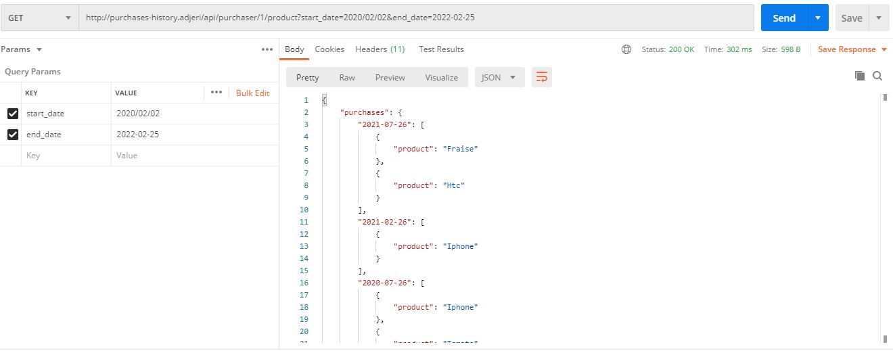

# Goal

RESTful API endpoints for managing a history of purchases



## Tech

Laravel 8, MySQL

## How to get the project running on your computer

Please do the following:

## Requirements

* Install WAMP or XAMPP or Laragon for the local server
* Install [Composer](https://getcomposer.org/download/)

Add composer, and npm them to the PATH if not done automatically.


## Install packages

Browse to the project folder from your terminal.

At the root of the project folder, run the following commands:

* To download the necessary Laravel packages for the backend:


```
composer install
```


## Set up the environment file for your computer

Copy the .env.debug file into .env or run the command below :

```
cp .env.debug .env
```

Generate a key for your app :

```
php artisan key:generate
```

Open the .env file and edit it according to the configuration of your computer.

The concerned parts are especially:

```
DB_CONNECTION=mysql
DB_HOST=your_host_address
DB_PORT=3306
DB_DATABASE=your_database_name
DB_USERNAME=your_username
DB_PASSWORD=your_password
```

Save it and close it.

In your terminal, run the next command to create the tables in the database:

```
php artisan migrate
```

## Running the project

Depending on the configuration of your system, to run the project, execute

```
php artisan serve
```

From the homepage, please see available endpoints.

*Happy dev* 😉
